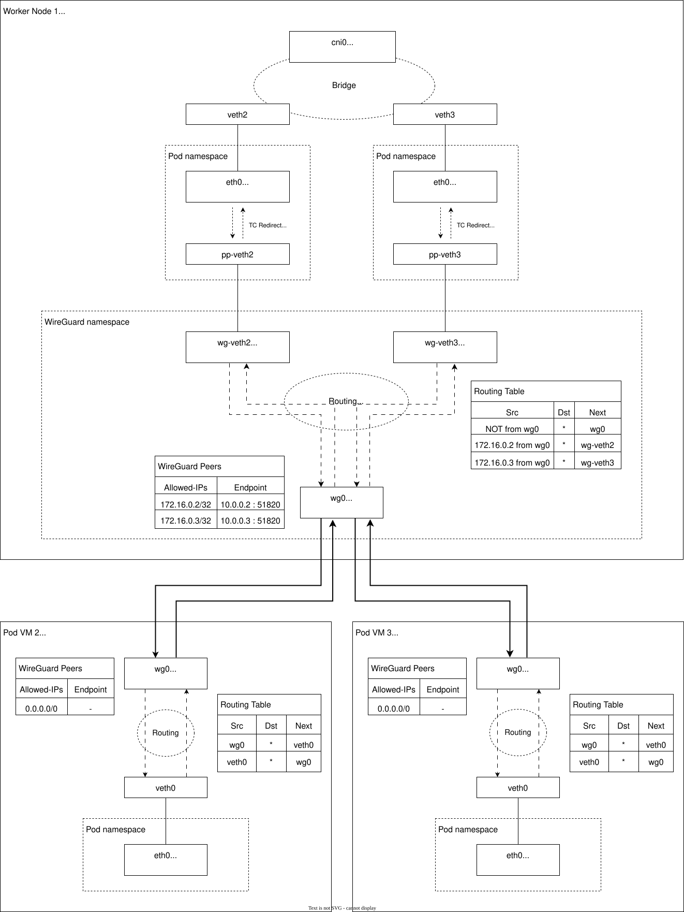

# WireGuard tunneling

This document describes a new network tunneling method for peer pods using [WireGuard](https://www.wireguard.com), an encrypted network encapsulation protocol.

Data-plane pod network traffics from and to a peer pod VM are transferred using a network tunnel between the peer pod VM and the worker node. Currently, the VXLAN encapsulation protocol is used to establish such a network tunnel for peer pod VMs. VXLAN tunneling works well in most cases, but is not suitable for some use cases.

The limitations of VXLAN mainly come from the following two missing features, while WireGuard supports both features.

* Encryption
* NAT traversal

VXLAN is a protocol that encapsulates an Ethernet packet in an UDP packet. An encapsulated Ethernet packet is not encrypted, and we need another secure encapsulation protocol such as IPSec to encrypt VXLAN traffics. Cloud API Adaptor does not support VXLAN over IPSec for now.

Lack of encryption does not directly mean that VXLAN tunneling is insecure. In our trust model, worker nodes are not trusted, so a peer pod cannot trust any network traffic coming from a worker node.  Workloads running on a peer pod typically need to use other protection mechanisms such as TLS to protect data-plane traffic against worker nodes as defense in depth.  Even so, encrypting network tunnel traffics may provide additional security in some use cases. For example, if data-plane network traffics go through the Internet, the possibility of random data exfiltration and DoS attacks is higher compared to the case of a closed network. 

WireGuard encrypts encapsulated packets using AEAD (Authenticated Encryption with Associated Data), so it is resilient to data exfiltration and DoS attacks.

Another advantage of WireGuard is the capability of [NAT traversal](https://www.wireguard.com/quickstart/#nat-and-firewall-traversal-persistence). The source port of a VXLAN UDP packet is randomly selected every time a new VXLAN packet is generated at the source machine. The Linux connection tracking system does not handle this behavior, and Linux's stateful NAT does not correctly process VXLAN packets. In the case of WireGuard, the source port of a WireGuard UDP packet is fixed, and Linux connection tracking system can recognize the streams of WireGuard packets, and Linux's stateful NAT can handle WireGuard packets correctly.

When a worker node is a WireGuard client, and a peer pod VM is a WireGuard server, we can put the worker node behind NAT and firewall while guaranteeing network connectivity from the worker node to the peer pod VM.

## Use cases

### Multi-Cloud deployment

One use case of the WireGuard tunnel is a scenario that involves multiple clouds. If a Kubernetes cluster is deployed in a public cloud A, and peer pod VMs are deployed in another public cloud B, and the clouds A and B are connected via the Internet.

When we use VXLAN for this setup, we need to assign global public IP addresses to all of worker nodes as well as peer pod VMs. We also need to correctly configure appropriate firewall rules for them.

If we can use WireGuard for this setup, global public IP addresses are only necessary for peer pod VMs, and we only need to assign local IP addresses to worker nodes. Suppose that outbound traffics are allowed and correctly NAT'd in cloud A. The connectivity of data-plane network traffics between the worker node and peer pod VM are guaranteed without complicated network configuration.

### KinD in a local machine and peer pod VMs in cloud

Another use case is a development scenario. Suppose that you have a Docker environment on your local development machine in your company, and the machine is behind company's NAT and firewall. You can run a Kubernetes Cluster using KinD (Kubernetes-in-Docker) to test peer pod VMs in a remote IaaS cloud by usingW the WireGuard tunneling.

## WireGuard key management

Each WireGuard network interface has a pair of public and private keys. One interface has a single public key and a list of peer WireGuard endpoints, each of which is identified by its public key.
This means that each peer pod VM needs to have its own public key, and multiple peer pod VMs cannot share a single public key. Otherwise, a worker node cannot distinguish multiple peer pod VMs.
For example, if we embed a pre-generated private key in a peer pod VM image and share the corresponding public key in the worker node, all peer pod VM instances create from the pod VM image have the same public key, and the worker node cannot distinguish them.

One solution of this problem is to generate a key pair of a new peer pod VM at the worker node, and pass the kay pair to the peer pod VM as a userdata. A similar approach is also adopted in [automatic TLS configuration](tls-proxy-forwarder.md). As explained above, we do not use WireGuard to protect data-plane traffics again worker nodes. From this perspective, we can a private key of a peer pod VM with the worker node.

## Design

WireGuard encapsulates an IP packet in a UDP packet, so encapsulate is done at an L3 (Layer 3) level. This means that we need a different design to implement WireGuard tunneling in the peer pod VM architecture from [VXLAN tunneling](vxlan-network-topology.md) where VXLAN encapsulates an Ethernet packet in a UDP packet and encapsulation is done at an L2 (Layer 2) level.

To implement L3-level tunneling in the peer pod VM architecture, we need (1) routing and (2) proxy ARP to forward packets between a network namespace configured by a CNI plugin in the pod network namespace and a WireGuard network interface configured by cloud-api-adaptor in the worker node.

The following diagram shows the basic design of the WireGuard tunneling in the peer pod VM architecture. We need a separated network namespace where a WireGuard network interface is created. We requires additional routing table entries to packets to forward packets from and to the WireGuard network interface, and the separated network namespace will avoid potential conflicts with existing routing table entries in the host network namespace of the worker node.

A virtual ethernet (veth) pair is created for a pod, and its one end is created in the pod namespace, and the other end is created in the WireGuard namespace.

In the pod namespace, packets between the CNI interface and the veth interface are forwarded using [Linux Traffic Control (TC) Redirect](https://man7.org/linux/man-pages/man8/tc-mirred.8.html). This technique is also used in [VXLAN tunneling](vxlan-network-topology.md).

In the WireGuard namespace, packets are forwarded between the veth interface and the WireGuard interface using [Linux Source/Policy based routing](https://tldp.org/HOWTO/Adv-Routing-HOWTO/lartc.rpdb.simple.html).  Proxy ARP is enabled with the veth interface in this namespace in order to respond ARP requests for the Pod IP address.

In the peer pod VM, we need similar veth interface configuration and routing table entries. We do not have concerns for conflicts with existing routing table entries in the peer pod VM, we do not create a separated network namespace here.

MACVLAN

